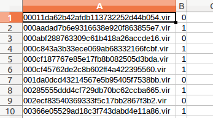

# 설치

```
pip install -r requirements.txt

```

```
#실행속성 추가
$ chmod +x ./*.sh
```

# 특징
엔트리포인트을 포함하고 있는 섹션의 엔트로피  

# 라벨



# 실행순서
```
01_extract.sh -> 02_learn.sh -> 03_predict.sh
```
  
```
# 특징추출
$ 01_extract.sh 
   -d 학습 데이터셋 경로
   -c 학습 데이터셋 라벨
   -o 추출한 특징을 저장할 경로
```
  
```
# 학습
$ 02_learn.sh 
   -d 추출한 특징이 있는 경로 ; 01_extract.sh의 -o 인자
   -o 학습한 모델을 저장할 경로   
```


```
# 예측
$ 01_extract.sh 
   -m 모델 경로 ; 02_learn.sh의 -o 인자
   -c 테스트 데이터셋 경로
   -o 예측 결과를 저장할 경로 ; 탐지율, confusin_matrix
```
    
# output
2018 데이터챌린지에서 배포한 학습 데이터셋으로 학습한 모델과 본선1차 결과

# Reference
https://github.com/CircleZ3791117/PEMalDetection.git  
paper : Han, S. W. and Lee, S. J. 2009. Packed PE File Detection for Malware Forensics. KIPS Journal C (2001 ~ 2012) , 16C, 5, (2009), 555-562